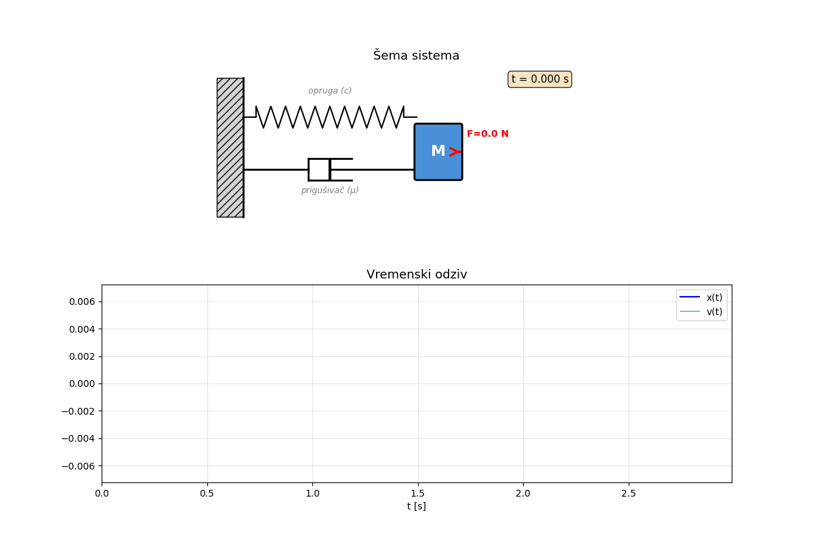

# Diferencijalna jednačina - Masa-opruga-prigušivač sistem

## Opis problema

$M \ddot{x} + \mu \dot{x} + c x = F = A P \sin(2\pi t)$

| Simbol | Opis | Jedinica |
|--------|------|----------|
| $M$ | masa | kg |
| $\mu$ | koeficijent prigušenja | — |
| $c$ | konstanta opruge | N/m |
| $A$ | površina | m² |
| $P$ | pritisak | N/m² |
| $x$ | pomeranje | m |
| $t$ | vreme | s |

## Animacija

## Korišćenje

Otvori `diferencijalna-jednacina.ipynb` u Jupyter notebook-u i pokreni sve ćelije.

## Rezultati

1. Grafik pomeranja `x(t)` i brzine `v(t)`
2. Analiza prolaznog režima
3. Ponašanje u ustaljenom režimu
4. Spektar snage brzine
5. Animacija sistema

## Zavisnosti

Python ≥ 3.9, NumPy, SciPy, Matplotlib, ipykernel

## Licenca

MIT
